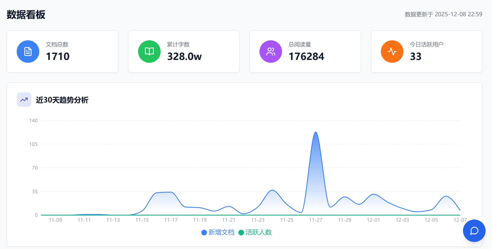
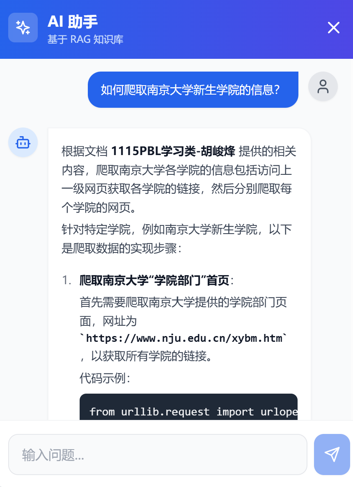
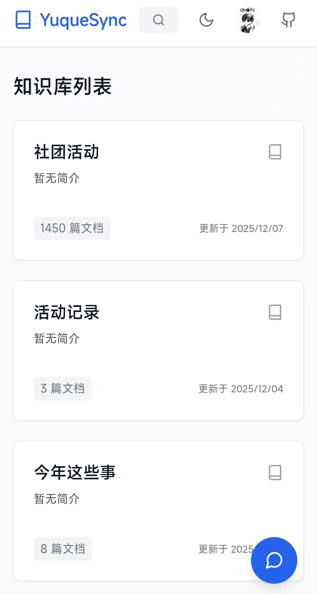

# 📚 Yuque Sync Platform


> **连接语雀与私有化智能知识库的桥梁。**
> 
> Yuque Sync Platform 是一个全栈企业级知识管理系统，它不仅能实时同步语雀文档，还提供了基于 RAG 的智能问答、全栈数据看板以及完善的社交协作功能。

---

## ✨ Key Features (功能特性)

| 模块 | 功能描述 |
| :--- | :--- |
| **🔄 核心同步** | 基于 **FastAPI + Webhook**，实现语雀文档、知识库、团队成员的**实时/全量同步**。支持目录结构自动重构与过期文档清理。 |
| **🧠 智能 RAG** | 集成 **LangChain + Qdrant + OpenAI**。支持**混合检索 (Hybrid Search)**、**AI 问答 (Chat)**、**文档摘要**，具备上下文记忆与元数据感知能力。 |
| **🔐 用户鉴权** | 完善的 **JWT 认证体系**。支持用户注册/登录、密码修改、邮箱绑定，并与语雀账号体系深度打通。 |
| **🤝 社交协作** | 构建知识社区。支持成员**互相关注**、**动态流 (Activity Feed)** 展示、以及基于 SMTP 的**邮件通知**服务。 |
| **📊 数据看板** | 基于 **MongoDB Aggregation** 的可视化仪表盘。提供**字数排行榜**、**阅读/点赞趋势图**、**活跃用户统计**等深度洞察。 |
| **🎨 现代化前端** | 采用 **React + Vite + Tailwind CSS** 构建。拥有美观的 UI 设计，支持**移动端适配** (Drawer/Modal)、图片拖拽预览、侧边栏自动展开等交互体验。 |
| **🐳 容器化部署** | 提供完整的 **Docker Compose** 编排方案，配合 **Nginx** 反向代理，实现一键构建与生产级部署。 |

---

## 🛠️ Tech Stack (技术栈)

### Backend (后端)
- **Framework**: FastAPI (Python 3.10+)
- **Database**: MongoDB (Beanie ODM), Qdrant (Vector DB)
- **AI & LLM**: LangChain, OpenAI API
- **Utilities**: FastAPI-Mail (邮件), APScheduler (定时任务)

### Frontend (前端)
- **Core**: React 18, Vite
- **Styling**: Tailwind CSS, DaisyUI
- **Visualization**: Recharts (数据图表)
- **Network**: Axios (拦截器处理鉴权)
- **Icons**: Lucide React

### Infrastructure (基础设施)
- **Container**: Docker, Docker Compose
- **Proxy**: Nginx
- **CI/CD**: GitHub Actions (Optional)

---

## ✅ Prerequisites (前置要求)

在开始之前，请确保您的环境满足以下要求：

- **Docker & Docker Compose** (推荐)
- **Python 3.10+** (本地开发后端)
- **Node.js 18+** (本地开发前端)
- **MongoDB 6.0+**
- **Qdrant 1.7+**

---

## 🚀 Quick Start (快速开始)

### 方式一：Docker 一键部署 (推荐)

这是最快体验完整功能的方式。

1.  **克隆仓库**
    ```bash
    git clone https://github.com/Gu-Heping/YuqueSyncPlatform.git
    cd YuqueSyncPlatform
    ```

2.  **配置环境变量**
    复制示例配置并填入您的 API Key 和语雀 Token。
    ```bash
    cp .env.example .env
    # 编辑 .env 文件
    ```

3.  **启动服务**
    ```bash
    docker-compose -f docker-compose.prod.yml up -d --build
    ```
    访问 `http://localhost` 即可看到系统界面。

### 方式二：本地开发

如果您需要修改代码或调试：

#### Backend
```bash
cd app
# 创建虚拟环境
python -m venv .venv
source .venv/bin/activate  # Windows: .venv\Scripts\Activate.ps1

# 安装依赖
pip install -r requirements.txt

# 启动服务
uvicorn app.main:app --reload --port 8000
```

#### Frontend
```bash
cd frontend
# 安装依赖
npm install

# 启动开发服务器
npm run dev
```
访问 `http://localhost:5173` 进行前端调试。

---

## ⚙️ Configuration (配置说明)

请在根目录 `.env` 文件中配置以下关键变量：

| 变量名 | 说明 | 示例 |
| :--- | :--- | :--- |
| `YUQUE_TOKEN` | 语雀 API Token (用于同步) | `EQ...` |
| `OPENAI_API_KEY` | OpenAI API Key (用于 RAG) | `sk-...` |
| `QDRANT_URL` | Qdrant 向量数据库地址 | `http://qdrant:6333` |
| `MONGODB_URL` | MongoDB 连接字符串 | `mongodb://mongo:27017` |
| `SECRET_KEY` | JWT 加密密钥 | `openssl rand -hex 32` |
| `MAIL_USERNAME` | SMTP 邮箱账号 | `example@gmail.com` |
| `MAIL_PASSWORD` | SMTP 邮箱授权码 | `xxxx` |
| `MAIL_SERVER` | SMTP 服务器地址 | `smtp.gmail.com` |

---

## 📸 Screenshots (截图展示)

### 📊 数据看板 (Dashboard)

*实时监控知识库动态，掌握团队活跃趋势。*

### 💬 智能问答 (AI Chat)

*基于 RAG 的智能助手，支持上下文多轮对话。*

### 📱 移动端适配 (Mobile)

*随时随地访问知识库，体验如原生应用般流畅。*

---

## 📄 License

This project is licensed under the [MIT License](LICENSE).
